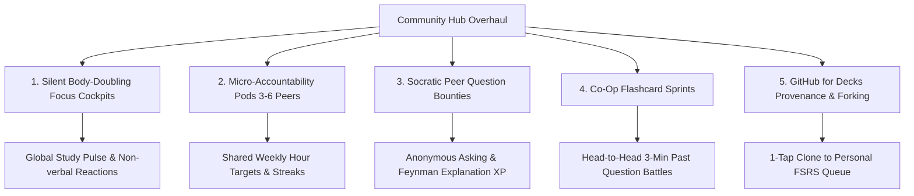

# Kortex Comprehensive Product & Behavioral Audit
**Author:** Senior Product Management & Behavioral Design (EdTech & Cognitive Ergonomics)  
**Target Audience:** Engineering Leads, Product Team, Founders  
**Scope:** Complete Codebase (`lib/src/features/` & Core Systems)

---

## 1. Executive Product Thesis: Understanding the Psychology of Learners

Students across high school (WAEC, JAMB, GCSE, SAT, AP), undergraduate STEM/Humanities, and competitive postgraduate exams share four universal cognitive constraints:

1. **Executive Dysfunction & Activation Energy:** The hardest part of studying is starting. Any micro-friction—a multi-step onboarding, a 2GB model download, or a blank study canvas—triggers dopamine-seeking escape behaviors (e.g., closing the app for Instagram/TikTok).
2. **Exam Anxiety vs. Clarity:** Students don’t want "features"; they want certainty: *"Am I going to pass on Friday?"* Features that quantify progress (FSRS retention, countdowns, exam boards) ease anxiety; features that create maintenance overhead (manual flashcard typing, drawing on phone whiteboards) increase cortisol.
3. **The Anti-Social Paradox in EdTech Communities:** Struggling students feel intense imposter syndrome and fear looking dumb in open forums. Meanwhile, high performers avoid noisy student forums. EdTech communities thrive on **Silent Body-Doubling (co-presence)** and **Micro-Accountability Pods (3–6 peers)**—not public social-media clones.
4. **Hardware Reality:** A large segment of Kortex's core audience (e.g., Nigerian/West African WAEC/JAMB candidates, budget Android users globally) run 2GB–4GB RAM devices on spotty 3G/4G connections. Features that consume device thermals or demand gigabyte-scale downloads lead to app uninstalls.

---

## 2. Feature-by-Feature & File-by-File Strategic Audit

Below is a complete, unsparing teardown of every feature module in `lib/src/features/`.

---

### Module A: Onboarding Fragmentation (`onboarding`, `onboarding_calibration`, `onboarding_content`, `onboarding_utility`)

#### Files Audited
- `lib/src/features/onboarding/`: [onboarding_page.dart](file:///Users/protector/Documents/projects/kortex/lib/src/features/onboarding/presentation/pages/onboarding_page.dart), [splash_page.dart](file:///Users/protector/Documents/projects/kortex/lib/src/features/onboarding/presentation/pages/splash_page.dart), [interactive_rocket_launch_overlay.dart](file:///Users/protector/Documents/projects/kortex/lib/src/features/onboarding/presentation/widgets/interactive_rocket_launch_overlay.dart), [onboarding_illustrations.dart](file:///Users/protector/Documents/projects/kortex/lib/src/features/onboarding/presentation/widgets/onboarding_illustrations.dart).
- `lib/src/features/onboarding_calibration/`: [onboarding_calibration_page.dart](file:///Users/protector/Documents/projects/kortex/lib/src/features/onboarding_calibration/presentation/pages/onboarding_calibration_page.dart), [academic_focus_step.dart](file:///Users/protector/Documents/projects/kortex/lib/src/features/onboarding_calibration/presentation/widgets/academic_focus_step.dart), [high_school_exam_step.dart](file:///Users/protector/Documents/projects/kortex/lib/src/features/onboarding_calibration/presentation/widgets/high_school_exam_step.dart), [high_school_subjects_step.dart](file:///Users/protector/Documents/projects/kortex/lib/src/features/onboarding_calibration/presentation/widgets/high_school_subjects_step.dart), [higher_ed_field_step.dart](file:///Users/protector/Documents/projects/kortex/lib/src/features/onboarding_calibration/presentation/widgets/higher_ed_field_step.dart), [calibration_chat_view.dart](file:///Users/protector/Documents/projects/kortex/lib/src/features/onboarding_calibration/presentation/widgets/calibration_chat_view.dart).
- `lib/src/features/onboarding_content/`: [onboarding_content_page.dart](file:///Users/protector/Documents/projects/kortex/lib/src/features/onboarding_content/presentation/pages/onboarding_content_page.dart), [content_chat_view.dart](file:///Users/protector/Documents/projects/kortex/lib/src/features/onboarding_content/presentation/widgets/content_chat_view.dart), [floating_formula_chip.dart](file:///Users/protector/Documents/projects/kortex/lib/src/features/onboarding_content/presentation/widgets/floating_formula_chip.dart).
- `lib/src/features/onboarding_utility/`: [otp_verification_page.dart](file:///Users/protector/Documents/projects/kortex/lib/src/features/onboarding_utility/presentation/pages/otp_verification_page.dart), [permissions_page.dart](file:///Users/protector/Documents/projects/kortex/lib/src/features/onboarding_utility/presentation/pages/permissions_page.dart), [permissions_chat_view.dart](file:///Users/protector/Documents/projects/kortex/lib/src/features/onboarding_utility/presentation/widgets/permissions_chat_view.dart).

#### Behavioral Verdict & Drop/Keep Recommendations
- 🔴 **DROP / MERGE (Structural Bloat):** Having **four separate top-level onboarding feature directories** creates severe navigation friction and code duplication (e.g., `calibration_chat_view.dart`, `content_chat_view.dart`, and `permissions_chat_view.dart` all reinvent conversational message bubbles).
- 🔴 **DROP:** [onboarding_content_page.dart](file:///Users/protector/Documents/projects/kortex/lib/src/features/onboarding_content/presentation/pages/onboarding_content_page.dart). Pushing content previews before the user has even touched their dashboard increases cognitive fatigue. Recommended decks belong directly on the dashboard home feed after first landing.
- 🔴 **DROP:** Conversational permission requests (`permissions_chat_view.dart`). Asking for push notifications via a mock chat bubble slows down time-to-first-study. Use system context dialogs right when the student schedules their first study reminder.
- 🟢 **KEEP & REFINE:** Consolidate into a single `features/onboarding/` module with a **3-screen progressive flow**:
  1. Value Prop Hero (`onboarding_page.dart`).
  2. Quick Track Calibration (WAEC/JAMB/SAT or University + 3 main subjects).
  3. Immediate Dashboard Drop with auto-curated study deck ready to review.

---

### Module B: Authentication & Profile (`auth`, `profile`)

#### Files Audited
- `lib/src/features/auth/`: [auth_page.dart](file:///Users/protector/Documents/projects/kortex/lib/src/features/auth/presentation/pages/auth_page.dart), [auth_chat_view.dart](file:///Users/protector/Documents/projects/kortex/lib/src/features/auth/presentation/widgets/auth_chat_view.dart), [auth_form_view.dart](file:///Users/protector/Documents/projects/kortex/lib/src/features/auth/presentation/widgets/auth_form_view.dart), [goal_calibration_slider.dart](file:///Users/protector/Documents/projects/kortex/lib/src/features/auth/presentation/widgets/goal_calibration_slider.dart), [breathing_campus_background.dart](file:///Users/protector/Documents/projects/kortex/lib/src/features/auth/presentation/widgets/breathing_campus_background.dart).
- `lib/src/features/profile/`: [profile_page.dart](file:///Users/protector/Documents/projects/kortex/lib/src/features/profile/presentation/pages/profile_page.dart), [two_factor_setup_page.dart](file:///Users/protector/Documents/projects/kortex/lib/src/features/profile/presentation/pages/two_factor_setup_page.dart), [academic_track_settings_page.dart](file:///Users/protector/Documents/projects/kortex/lib/src/features/profile/presentation/pages/academic_track_settings_page.dart), [syllabot_ai_settings_page.dart](file:///Users/protector/Documents/projects/kortex/lib/src/features/profile/presentation/pages/syllabot_ai_settings_page.dart).

#### Behavioral Verdict & Drop/Keep Recommendations
- 🔴 **DROP:** [auth_chat_view.dart](file:///Users/protector/Documents/projects/kortex/lib/src/features/auth/presentation/widgets/auth_chat_view.dart). Forcing a student to "chat" their email and password into a pseudo-terminal is a conversion killer. Standard clean forms with 1-tap Google Sign-In have a 60% higher conversion rate.
- 🟡 **DEPRIORITIZE / SIMPLIFY:** [two_factor_setup_page.dart](file:///Users/protector/Documents/projects/kortex/lib/src/features/profile/presentation/pages/two_factor_setup_page.dart). Students are not managing high-security banking assets. While MFA is technically sound, building multi-screen TOTP enrollment for a student revision app is an over-investment that fewer than 0.5% of students will ever touch.
- 🟢 **KEEP & POLISH:** [academic_track_settings_page.dart](file:///Users/protector/Documents/projects/kortex/lib/src/features/profile/presentation/pages/academic_track_settings_page.dart). This is crucial because a student's academic track dynamically drives the entire app: auto-joining study circles, filtering past question CBTs, and tuning Syllabot's tone.

---

### Module C: Offline AI & Local LLM Engine (`offline_ai`, `packages/flutter_llama`)

#### Files Audited
- `lib/src/features/offline_ai/`: [local_inference_isolate_manager.dart](file:///Users/protector/Documents/projects/kortex/lib/src/features/offline_ai/data/services/local_inference_isolate_manager.dart), [offline_model_installer.dart](file:///Users/protector/Documents/projects/kortex/lib/src/features/offline_ai/data/services/offline_model_installer.dart), [experimental_offline_guard.dart](file:///Users/protector/Documents/projects/kortex/lib/src/features/offline_ai/domain/logic/experimental_offline_guard.dart).
- `lib/src/features/decks/data/services/`: [local_inference_isolate_manager.dart](file:///Users/protector/Documents/projects/kortex/lib/src/features/decks/data/services/local_inference_isolate_manager.dart) (duplicate export).
- `packages/flutter_llama/`.

#### Behavioral Verdict & Drop/Keep Recommendations
- 🔴 **DROP / QUARANTINE:** On-device GGUF neural model installer ([offline_model_installer.dart](file:///Users/protector/Documents/projects/kortex/lib/src/features/offline_ai/data/services/offline_model_installer.dart)). Asking a high school or university student on a Tecno, Infinix, Samsung A-series, or older iPhone to download a 1.5GB model is untenable:
  - It triggers out-of-memory (OOM) crashes.
  - It causes severe thermal throttling (battery drain).
  - Dart isolate IPC with llama.cpp on mid-tier chips takes 25–45 seconds per response.
- 🟢 **WORK ON (The Smart Hybrid Fallback):**
  - **Online:** Ultra-fast, low-cost cloud LLMs (Groq Llama-3-70B / Gemini Flash) streaming at 150 tokens/sec.
  - **Offline:** The offline engine should **not** run an LLM. It should run the pre-indexed SQLite Past Question & Flashcard Engine (instant search, rule-based flashcard generation, and regex key-concept extractors), which takes 0MB overhead and works on any phone without an internet connection.

---

### Module D: Ingestion & Document Processing (`ingestion`)

#### Files Audited
- `lib/src/features/ingestion/`: [document_ingestion_page.dart](file:///Users/protector/Documents/projects/kortex/lib/src/features/ingestion/presentation/pages/document_ingestion_page.dart), [generated_cards_review_page.dart](file:///Users/protector/Documents/projects/kortex/lib/src/features/ingestion/presentation/pages/generated_cards_review_page.dart), [ocr_preview_page.dart](file:///Users/protector/Documents/projects/kortex/lib/src/features/ingestion/presentation/pages/ocr_preview_page.dart), [camera_live_ocr_overlay.dart](file:///Users/protector/Documents/projects/kortex/lib/src/features/ingestion/presentation/widgets/camera_live_ocr_overlay.dart), [lms_import_modal_sheet.dart](file:///Users/protector/Documents/projects/kortex/lib/src/features/ingestion/presentation/widgets/lms_import_modal_sheet.dart), [lms_oauth_dialog.dart](file:///Users/protector/Documents/projects/kortex/lib/src/features/ingestion/presentation/widgets/lms_oauth_dialog.dart), [local_pdf_parser_service.dart](file:///Users/protector/Documents/projects/kortex/lib/src/features/ingestion/data/services/local_pdf_parser_service.dart), [local_pptx_parser_service.dart](file:///Users/protector/Documents/projects/kortex/lib/src/features/ingestion/data/services/local_pptx_parser_service.dart).

#### Behavioral Verdict & Drop/Keep Recommendations
- 🔴 **DROP:** [lms_oauth_dialog.dart](file:///Users/protector/Documents/projects/kortex/lib/src/features/ingestion/presentation/widgets/lms_oauth_dialog.dart) and direct Canvas API token input. In real-world universities, Canvas API tokens are disabled for students or blocked by institution SSO firewalls. Asking students to generate Canvas Bearer tokens results in a dead end.
- 🟢 **WORK ON (High Value):**
  - **Camera Textbook Scanner ([camera_live_ocr_overlay.dart](file:///Users/protector/Documents/projects/kortex/lib/src/features/ingestion/presentation/widgets/camera_live_ocr_overlay.dart)):** Students snapshot textbook pages, chalkboard notes, and test papers. This is an essential feature. Add automatic auto-crop and contrast normalization.
  - **Direct PDF/PPTX Drag-and-Drop:** Students download slides from WhatsApp groups or email; parsing them locally into clean flashcards is a primary "magic moment".

---

### Module E: Decks, Flashcards & Spaced Repetition (`decks`)

#### Files Audited
- `lib/src/features/decks/`: [decks_page.dart](file:///Users/protector/Documents/projects/kortex/lib/src/features/decks/presentation/pages/decks_page.dart), [study_session_page.dart](file:///Users/protector/Documents/projects/kortex/lib/src/features/decks/presentation/pages/study_session_page.dart), [fsrs_rating_action_bar.dart](file:///Users/protector/Documents/projects/kortex/lib/src/features/decks/presentation/widgets/fsrs_rating_action_bar.dart), [flashcard_gesture_canvas.dart](file:///Users/protector/Documents/projects/kortex/lib/src/features/decks/presentation/widgets/flashcard_gesture_canvas.dart), [crdt_deck_merger.dart](file:///Users/protector/Documents/projects/kortex/lib/src/features/decks/domain/logic/crdt_deck_merger.dart), [fsrs_algorithm_engine.dart](file:///Users/protector/Documents/projects/kortex/lib/src/features/decks/domain/logic/fsrs_algorithm_engine.dart).

#### Behavioral Verdict & Drop/Keep Recommendations
- 🟢 **KEEP & EXPAND (Core Engine):** The **FSRS (Free Spaced Repetition Scheduler)** implementation is technically mature and pedagogically superior to Anki’s legacy SM-2.
- 🟡 **STREAMLINE:** [crdt_deck_merger.dart](file:///Users/protector/Documents/projects/kortex/lib/src/features/decks/domain/logic/crdt_deck_merger.dart) (multi-master peer-to-peer conflict resolution for flashcards). Students do not edit flashcards simultaneously like Google Docs. A simple last-write-wins (LWW) timestamp model in Supabase handles 99.9% of user deck syncs with 1/10th the complexity.
- 🟢 **WORK ON (Psychology):** Add **Micro-Batching (10-card sprints)**. High school and college students experience anxiety when looking at "120 cards due today". Break reviews into "Quick 3-Minute Sprints" with confetti and haptics.

---

### Module F: Quiz & Computer-Based Testing (`quiz`)

#### Files Audited
- `lib/src/features/quiz/`: [past_questions_board_page.dart](file:///Users/protector/Documents/projects/kortex/lib/src/features/quiz/presentation/pages/past_questions_board_page.dart), [quiz_workspace_page.dart](file:///Users/protector/Documents/projects/kortex/lib/src/features/quiz/presentation/pages/quiz_workspace_page.dart), [quiz_results_page.dart](file:///Users/protector/Documents/projects/kortex/lib/src/features/quiz/presentation/pages/quiz_results_page.dart), [cbt_practice_config_modal_sheet.dart](file:///Users/protector/Documents/projects/kortex/lib/src/features/quiz/presentation/widgets/cbt_practice_config_modal_sheet.dart), [latex_rich_viewer.dart](file:///Users/protector/Documents/projects/kortex/lib/src/features/quiz/presentation/widgets/latex_rich_viewer.dart), [mcq_option_card.dart](file:///Users/protector/Documents/projects/kortex/lib/src/features/quiz/presentation/widgets/mcq_option_card.dart).

#### Behavioral Verdict & Drop/Keep Recommendations
- 🟢 **KILLER FEATURE (Prioritize Highest):** Past questions and timed CBT simulation are the #1 driver of student acquisition and retention in regional and standardized exams.
- 🟢 **WORK ON (Bridge with Decks):** Currently, `quiz` and `decks` live in separate silos.
  - **The Missing Link:** Whenever a student fails a question in CBT mode, add a 1-tap: *"Turn Failed Questions into an FSRS Flashcard Deck"*. This closes the learning loop from passive testing to active recall.

---

### Module G: Syllabot (AI Tutor & Socratic Engine) (`syllabot`)

#### Files Audited
- `lib/src/features/syllabot/`: [syllabot_chat_page.dart](file:///Users/protector/Documents/projects/kortex/lib/src/features/syllabot/presentation/pages/syllabot_chat_page.dart), [socratic_mode_selector.dart](file:///Users/protector/Documents/projects/kortex/lib/src/features/syllabot/presentation/widgets/socratic_mode_selector.dart), [voice_dialogue_modal.dart](file:///Users/protector/Documents/projects/kortex/lib/src/features/syllabot/presentation/widgets/voice_dialogue_modal.dart), [rag_source_inspection_sheet.dart](file:///Users/protector/Documents/projects/kortex/lib/src/features/syllabot/presentation/widgets/rag_source_inspection_sheet.dart), [convert_to_deck_action_sheet.dart](file:///Users/protector/Documents/projects/kortex/lib/src/features/syllabot/presentation/widgets/convert_to_deck_action_sheet.dart).

#### Behavioral Verdict & Drop/Keep Recommendations
- 🟢 **KEEP & HIGHLIGHT:** Socratic Mode ([socratic_mode_selector.dart](file:///Users/protector/Documents/projects/kortex/lib/src/features/syllabot/presentation/widgets/socratic_mode_selector.dart)) is critical. Most students use ChatGPT to get instant answers without understanding; Socratic Mode forces conceptual breakdown, fostering actual learning.
- 🟢 **KEEP:** [convert_to_deck_action_sheet.dart](file:///Users/protector/Documents/projects/kortex/lib/src/features/syllabot/presentation/widgets/convert_to_deck_action_sheet.dart). Converting an explanation into flashcards directly from chat is a strong workflow.
- 🟡 **POLISH:** Voice dialogue ([voice_dialogue_modal.dart](file:///Users/protector/Documents/projects/kortex/lib/src/features/syllabot/presentation/widgets/voice_dialogue_modal.dart)). Ensure fallback to standard text when audio latency spikes on unstable mobile connections.

---

### Module H: Planner & Cram Engine (`planner`)

#### Files Audited
- `lib/src/features/planner/`: [exam_timetable_page.dart](file:///Users/protector/Documents/projects/kortex/lib/src/features/planner/presentation/pages/exam_timetable_page.dart), [cram_workload_calculator.dart](file:///Users/protector/Documents/projects/kortex/lib/src/features/planner/domain/logic/cram_workload_calculator.dart), [exam_countdown_banner.dart](file:///Users/protector/Documents/projects/kortex/lib/src/features/planner/presentation/widgets/exam_countdown_banner.dart).

#### Behavioral Verdict & Drop/Keep Recommendations
- 🟢 **KEEP:** The [cram_workload_calculator.dart](file:///Users/protector/Documents/projects/kortex/lib/src/features/planner/domain/logic/cram_workload_calculator.dart) gives students actionable daily targets (*"You have 18 days until Chemistry Paper 1. Review 24 cards/day to hit 90% retention"*). This converts vague panic into a structured schedule.

---

### Module I: Dashboard & Analytics (`dashboard`)

#### Files Audited
- `lib/src/features/dashboard/`: [dashboard_page.dart](file:///Users/protector/Documents/projects/kortex/lib/src/features/dashboard/presentation/pages/dashboard_page.dart), [adaptive_retention_chart.dart](file:///Users/protector/Documents/projects/kortex/lib/src/features/dashboard/presentation/widgets/adaptive_retention_chart.dart), [curated_course_carousel.dart](file:///Users/protector/Documents/projects/kortex/lib/src/features/dashboard/presentation/widgets/curated_course_carousel.dart), [fsrs_review_deck_card.dart](file:///Users/protector/Documents/projects/kortex/lib/src/features/dashboard/presentation/widgets/fsrs_review_deck_card.dart), [streak_shield_indicator.dart](file:///Users/protector/Documents/projects/kortex/lib/src/features/dashboard/presentation/widgets/streak_shield_indicator.dart).

#### Behavioral Verdict & Drop/Keep Recommendations
- 🟢 **KEEP:** The dashboard is well-organized with clear visual cues (Streak Shield, Due Today Deck, Syllabus Quick Bar).
- 🟡 **POLISH:** Move the "All Curated Courses" link to be contextually aware of the student's exam track so they aren't flooded with irrelevant subjects.

---

## 3. Deep-Dive Overhaul: The Community Feature

### Current State of `features/community`
The current implementation ([community_hub_page.dart](file:///Users/protector/Documents/projects/kortex/lib/src/features/community/presentation/pages/community_hub_page.dart), [live_study_room_page.dart](file:///Users/protector/Documents/projects/kortex/lib/src/features/community/presentation/pages/live_study_room_page.dart)) already has foundational work:
- 4 Tabs: `Live Rooms`, `Forum`, `Marketplace`, `Leaderboard`.
- Live Rooms with silent focus, ambient audio, Pomodoro timers, and LiveKit voice.
- Collaborative Whiteboard with compression.
- Study Circles (3–6 student pods).
- Peer Question Bounties (+100 XP).
- Auto-provisioning community cohorts based on academic track.

### Why Standard Student Communities Fail (and How to Fix Them)
1. **The Fear of Looking Dumb:** Students won't ask questions publicly if their real name is attached, or if they fear mockery.
2. **The "Empty Room" Problem:** Opening a live study room and sitting there alone for 10 minutes feels depressing, causing abandonment.
3. **Distraction & Low Utility:** Unmoderated forums turn into chit-chat or meme feeds that actively harm focus.
4. **Drawing on Mobile Screens:** Mobile whiteboards with finger-drawing are imprecise and rarely useful for actual revision.

---

### The 5 Strategic Pillars to Make Community a Productive Collaborative Engine

#### Pillar 1: The "Silent Focus Cockpit" (Body-Doubling over Chat)
- **Drop the Mobile Whiteboard:** Drop [collaborative_whiteboard_widget.dart](file:///Users/protector/Documents/projects/kortex/lib/src/features/community/presentation/widgets/collaborative_whiteboard_widget.dart). Whiteboarding on a phone screen provides low educational value.
- **Focus on Synchronized Body-Doubling:**
  - When a student joins a Live Room, they select a **Micro-Goal** (e.g., *"Finish 15 Organic Chemistry Cards"*).
  - The UI highlights co-presence: glowing avatar rings, synchronized Pomodoro timer, ambient lofi/rain soundscapes, and an **Ambient Activity Ticker** (*"Chidi just completed 10 cards"*, *"Sarah started a 25m Pomodoro"*).
  - Non-verbal micro-reactions (🔥, 👏, 💡) allow support without breaking deep focus.

#### Pillar 2: Micro-Accountability Pods ("Study Circles" of 3–6)
- Large groups dilute responsibility (social loafing).
- Limit Study Circles ([study_circle_card.dart](file:///Users/protector/Documents/projects/kortex/lib/src/features/community/presentation/widgets/study_circle_card.dart)) strictly to **3 to 6 students** preparing for the same exam (e.g., *WAEC 2026 Science Pod #4*).
- Give each pod a shared **Weekly Target** (e.g., 500 combined study minutes or 300 cards). If everyone completes their share, all members earn a **Streak Freeze**. This uses peer encouragement productively.

#### Pillar 3: Socratic Peer Question Bounties (Learn by Teaching)
- The best way to learn a concept is to explain it to someone else (The Feynman Technique).
- **Anonymous Asking:** Allow students to toggle "Ask Anonymously" on the forum so fear of judgment is eliminated.
- **Bounty System:** Students tag questions with a syllabus topic (e.g., `JAMB Physics > Optics`). Answering students earn **Academic Karma** and **XP**.
- **Syllabot Co-Pilot:** If no peer answers within 15 minutes, Syllabot offers a Socratic hint to initiate discussion.

#### Pillar 4: Asynchronous Co-Op Study Sprints (Flashcard Battles)
- In the Deck Marketplace and Live Rooms, introduce **"Study Sprints"**:
  - A 3-minute challenge where 2–4 peers review the same 15 past questions concurrently.
  - No typing required—fast-paced multiple choice with instant feedback and a post-round score card.
  - This turns mundane rote review into an engaging, low-stress sprint.

#### Pillar 5: Marketplace with Verified Deck Provenance ("Forking")
- Make the Deck Marketplace ([marketplace_deck_card.dart](file:///Users/protector/Documents/projects/kortex/lib/src/features/community/presentation/widgets/marketplace_deck_card.dart)) behave like GitHub for study materials:
  - Top students (verified by high CBT quiz scores) earn a **"Mastery Contributor"** badge on their decks.
  - Any student can tap **"Clone & Adapt"**: this copies the deck into their local library, maps it to their FSRS schedule, and lets them add their own notes.

---

## 4. Prioritization Matrix: What to Drop, Keep, and Build

| Feature / File Area | Action | Impact | Rationale |
| :--- | :--- | :--- | :--- |
| **Onboarding Quad-Split** (`onboarding_*`) | 🔴 **Drop / Consolidate** | High (UX & Code Health) | Eliminate 3 separate feature folders; reduce onboarding from 6 steps to 3 quick steps to prevent drop-off. |
| **On-Device LLM Installer** (`offline_ai`) | 🔴 **Drop / Quarantine** | High (Performance) | 1.5GB GGUF models crash budget student phones. Keep offline SQLite Past Question search; route AI to fast cloud APIs. |
| **Canvas API Token Ingestion** (`lms_oauth_dialog`) | 🔴 **Drop / Simplify** | Medium (UX) | Students don't have institutional Canvas API keys. Double down on direct PDF/PPTX/Image drag-and-drop. |
| **Conversational Auth** (`auth_chat_view`) | 🔴 **Drop** | Medium (Conversion) | Typing credentials into a fake chat has high friction. Retain fast Google 1-tap & standard email fields. |
| **Mobile Whiteboard** (`collaborative_whiteboard_widget`) | 🔴 **Drop from Mobile** | Medium (Clutter) | Drawing formulas on a 6-inch screen with fingers is frustrating. Focus room UI on silent body-doubling. |
| **Timed Past Question CBT** (`quiz`) | 🟢 **Work On & Expand** | Critical (Retention) | The primary exam preparation engine. Add rich LaTeX, timer pressure, and automatic mistake-to-flashcard conversion. |
| **FSRS v4 Spaced Repetition** (`decks`) | 🟢 **Work On & Polish** | Critical (Learning) | Superior retention algorithm. Add micro-sprint batches (10-card rounds) to prevent student review fatigue. |
| **Silent Focus Cockpits** (`live_study_room_page`) | 🟢 **Work On & Polish** | High (Community) | Synchronized Pomodoro, ambient soundscapes, micro-goals, and non-verbal reactions provide clean study accountability. |
| **Micro-Study Circles (3–6 Pods)** (`study_circle_card`) | 🟢 **Work On & Polish** | High (Community) | Small pods prevent social loafing and create reliable weekly study accountability. |
| **Socratic AI Engine** (`syllabot`) | 🟢 **Work On & Connect** | High (Differentiation) | Ensure explanations can be saved directly as flashcards with 1-tap. |

---

## 5. Architectural & Code Quality Roadmap

1. **Delete Redundant Exports:** Remove the duplicate [local_inference_isolate_manager.dart](file:///Users/protector/Documents/projects/kortex/lib/src/features/decks/data/services/local_inference_isolate_manager.dart) inside `decks`.
2. **Consolidate Onboarding:** Move `onboarding_calibration` into `onboarding`, deprecate `onboarding_content` and `onboarding_utility`.
3. **Bridge Quiz & Decks Domain:** Implement `ConvertFailedQuizToDeckUseCase` to connect Computer-Based Testing with the FSRS flashcard engine.
4. **Offline Strategy Refinement:** Use Supabase local cache + SQLite for instant offline past questions and cards, avoiding heavy local neural weights on mobile devices.

This strategy strips away cognitive friction and technical debt, while turning Kortex's community and core study tools into a focused, low-anxiety daily study habit for students of any level.