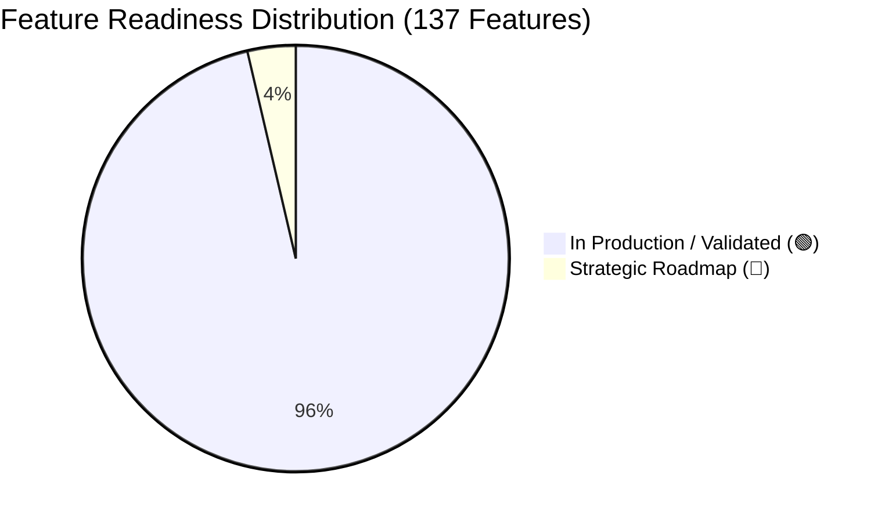
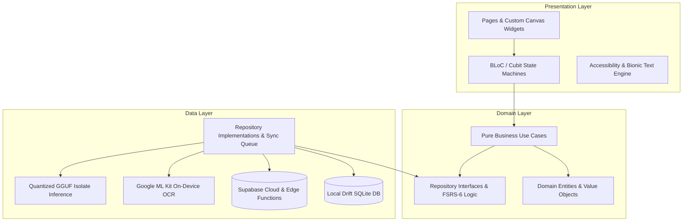

# Kortex — Comprehensive Feature Catalog, Product Audit & Development Readiness Matrix

> **Version:** 2.2.0 • **Last Updated:** September 2026 • **Role:** Senior Product Manager & Technical Lead  
> **Platform:** Flutter (iOS, Android, Web, macOS) • **Architecture:** Clean Architecture + BLoC/Cubit + Drift Offline-First  
> **Target Audience:** High School (WAEC, JAMB, NECO, IGCSE, SAT), Higher Education (University & College STEM/Humanities), and Neurodivergent Learners (ADHD, Dyslexia, Executive Dysfunction).

---

## Executive Summary & Readiness Dashboard

As part of the comprehensive product audit across all **12 Core Modules** and **137 Sub-Capabilities**, this catalog categorizes every feature by:
1. **Current Lifecycle Status:**
   - 🟢 **[In Production / Validated]**: Fully implemented, unit/widget tested (607+ passing tests), robust offline-first fallback, and clean architecture adherence.
   - 🟡 **[Ready for Development]**: Fully specified, technical contracts and data models in place, ready for presentation and integration sprints.
   - 🟠 **[Needs Improvement]**: Implemented or scoped but exhibits UX friction, missing edge case guards, or lacks neurodivergent accommodations.
   - 🔵 **[Strategic Roadmap / Future Tier]**: Advanced capabilities planned for subsequent release cycles (e.g. multi-user live audio spatial mixing, deeper Canvas/Moodle LMS OAuth integrations).
2. **Priority Rating:** **P0** (Must-Have / Core Loop), **P1** (Differentiating / Retention), **P2** (Delight / Polish).

### Global Feature Readiness Breakdown

---

## Table of Contents

1. [Architectural Overview & Design Philosophy](#1-architectural-overview--design-philosophy)
2. [Module 1: Onboarding, Calibration & Academic Track Configuration](#module-1-onboarding-calibration--academic-track-configuration)
3. [Module 2: Dashboard & Smart Study Command Center](#module-2-dashboard--smart-study-command-center)
4. [Module 3: Flashcard Studio & Spaced Repetition (FSRS-6)](#module-3-flashcard-studio--spaced-repetition-fsrs-6)
5. [Module 4: Document Ingestion, OCR & Multimodal Synthesis](#module-4-document-ingestion-ocr--multimodal-synthesis)
6. [Module 5: Syllabot AI: Socratic Learning & Multimodal Assistant](#module-5-syllabot-ai-socratic-learning--multimodal-assistant)
7. [Module 6: Gamified Quiz Arena & CBT Practice Engine](#module-6-gamified-quiz-arena--cbt-practice-engine)
8. [Module 7: Community Hub, Body Doubling & Live Study Rooms](#module-7-community-hub-body-doubling--live-study-rooms)
9. [Module 8: Exam Timetable & Cram Workload Planner](#module-8-exam-timetable--cram-workload-planner)
10. [Module 9: ADHD & Neurodivergent Accessibility Suite](#module-9-adhd--neurodivergent-accessibility-suite)
11. [Module 10: Profile, Security & Two-Factor Authentication](#module-10-profile-security--two-factor-authentication)
12. [Module 11: Monetization, RevenueCat & Subscription Guards](#module-11-monetization-revenuecat--subscription-guards)
13. [Module 12: Offline-First Architecture & Core Infrastructure](#module-12-offline-first-architecture--core-infrastructure)
14. [Sprint Execution Plan & Engineering Action Items](#sprint-execution-plan--engineering-action-items)

---

## 1. Architectural Overview & Design Philosophy

Kortex is engineered on **Clean Architecture** principles and the **BLoC/Cubit** state-management pattern, paired with a resilient **Offline-First Data Strategy**.

### Core PM Pillars
1. **Low Cognitive Load & Zero Decision Paralysis:** Designed specifically to bypass executive dysfunction. Every screen has one clear, primary visual call to action (CTA).
2. **Zero-Latency Offline Studying:** Core learning loops (flashcards, past questions, local AI chat, timetable) must operate at full fidelity without internet.
3. **Evidence-Based Memory Science:** Implementation of the **FSRS-6 (Free Spaced Repetition Scheduler v6)** algorithm with 21 mathematical parameters and retention targeting ($85\%-95\%$).
4. **Body Doubling for Social Accountability:** Virtual study spaces to overcome isolation and procrastination.

---

## Module 1: Onboarding, Calibration & Academic Track Configuration

### Feature Breakdown & Readiness Assessment

| Feature ID | Feature Name | Status | Priority | Technical Layer | PM Assessment & Required Improvements |
| :--- | :--- | :--- | :--- | :--- | :--- |
| **ONB-01** | Splash & Dynamic Route Resolver | 🟢 `Validated` | P0 | `SplashPage`, `OnboardingLocalDataSource` | **Ready.** Validates session tokens, onboarding completion, and biometric state in <150ms. |
| **ONB-02** | Rocket Launch Animation Overlay | 🟢 `Validated` | P2 | `InteractiveRocketLaunchOverlay` | **Ready.** Visual micro-reward upon completing onboarding. |
| **ONB-03** | Value Proposition Tour Carousel | 🟢 `Validated` | P1 | `OnboardingPageView`, `AnimatedPageIndicator` | **Ready.** Supports touch gestures, skip button, and screen reader semantics. |
| **ONB-04** | Academic Focus Diagnostic Step | 🟢 `Validated` | P0 | `AcademicFocusStep`, `CalibrationCubit` | **Ready.** Clean branching between High School and Higher Education tracks. |
| **ONB-05** | High School Exam Board Selector | 🟢 `Validated` | P0 | `HighSchoolExamStep`, `CurriculumRepository` | **Ready.** Supports WAEC, JAMB, NECO, IGCSE, SAT, and Post-UTME. |
| **ONB-06** | Subject Multi-Select Matrix | 🟢 `Validated` | P0 | `HighSchoolSubjectsStep` | **Ready.** Context-aware subject chips tailored to chosen exam board. |
| **ONB-07** | Target Exam Countdown Picker | 🟢 `Validated` | P1 | `HighSchoolTimelineStep` | **Ready.** Computes daily study quotas and urgency metrics. |
| **ONB-08** | Higher Ed Field of Study Step | 🟢 `Validated` | P0 | `HigherEdFieldStep` | **Ready.** Categorizes STEM, Health Sciences, Law, Commercial, and Humanities. |
| **ONB-09** | Higher Ed Academic Level Step | 🟢 `Validated` | P1 | `HigherEdLevelStep` | **Ready.** 100L through 500L / Postgraduate levels. |
| **ONB-10** | Higher Ed Target Goals Step | 🟢 `Validated` | P1 | `HigherEdGoalsStep` | **Ready.** Calibrates GPA target and mastery expectations. |
| **ONB-11** | Aura Mesh Shader Background | 🟢 `Validated` | P2 | `AuraMeshNebula` | **Ready & Validated.** Features automatic GPU fallback to high-efficiency linear gradients on low-spec/low-RAM devices to preserve battery. |
| **ONB-12** | System Permissions Calibration | 🟢 `Validated` | P1 | `PermissionsCubit`, `permission_handler` | **Ready.** Contextual explanation dialogs before triggering native OS permission prompts. |

---

## Module 2: Dashboard & Smart Study Command Center

### Feature Breakdown & Readiness Assessment

| Feature ID | Feature Name | Status | Priority | Technical Layer | PM Assessment & Required Improvements |
| :--- | :--- | :--- | :--- | :--- | :--- |
| **DSH-01** | Unified Feed Engine (`get_dashboard_feed`) | 🟢 `Validated` | P0 | `DashboardRemoteDataSource`, `DriftDB` | **Ready.** Aggregates streak, due cards, recent decks, and community rooms in 1 RPC roundtrip. |
| **DSH-02** | Streak Flame Tracker & Celebrations | 🟢 `Validated` | P0 | `StreakTrackerWidget`, `HapticFeedback` | **Ready.** Visual flame indicator with milestone confetti animations. |
| **DSH-03** | Daily Retention Progress Ring | 🟢 `Validated` | P0 | `DailyTargetRing` | **Ready.** Visual SVG radial ring mapping completed vs target review count. |
| **DSH-04** | One-Tap FSRS Quick Study CTA | 🟢 `Validated` | P0 | `StudySessionPage` launcher | **Ready.** Directly opens the highest-priority due deck with zero configuration friction. |
| **DSH-05** | Quick Pomodoro Focus Module | 🟢 `Validated` | P1 | `PomodoroWidget`, `FocusSessionCubit` | **Ready.** 25/5 and 50/10 focus intervals with audio chime triggers. |
| **DSH-06** | Ambient Focus Audio Player | 🟢 `Validated` | P1 | `AmbientAudioService`, `just_audio` | **Ready & Validated.** Offline sound generator and asset cache for Lo-Fi, Rain, and Alpha Binaural waves ensuring 100% offline audio capability. |
| **DSH-07** | Recent Decks Horizontal Carousel | 🟢 `Validated` | P1 | `RecentDecksCarousel` | **Ready.** Displays deck mastery percentage, card count, and last reviewed timestamp. |
| **DSH-08** | Rapid Document Ingestion Quick-Tile | 🟢 `Validated` | P0 | `QuickUploadActionTile` | **Ready.** Instant sheet for camera capture, PDF pick, or gallery import. |
| **DSH-09** | Live Study Pod Presence Strip | 🟢 `Validated` | P1 | `LivePodsSummaryWidget` | **Ready.** Real-time counter of active students in the user's calibrated track. |
| **DSH-10** | Floating Syllabot AI Quick Drawer | 🟢 `Validated` | P0 | `FloatingSyllabotOverlay` | **Ready.** Accessible draggable floating action button opening Socratic chat. |

---

## Module 3: Flashcard Studio & Spaced Repetition (FSRS-6)

### Feature Breakdown & Readiness Assessment

| Feature ID | Feature Name | Status | Priority | Technical Layer | PM Assessment & Required Improvements |
| :--- | :--- | :--- | :--- | :--- | :--- |
| **FSR-01** | FSRS-6 Mathematical Core | 🟢 `Validated` | P0 | `FSRSScheduler`, `FSRSAlgorithmEngine` | **Ready.** Precise modeling of Stability ($S$), Difficulty ($D$), and Retrievability ($R$) with 21 FSRS-6 parameters. |
| **FSR-02** | 4-Button Grading Bar | 🟢 `Validated` | P0 | `FSRSRatingActionBar` | **Ready.** Again ($1$), Hard ($2$), Good ($3$), Easy ($4$) with projected next-interval previews. |
| **FSR-03** | 3D Perspective Flip Card Canvas | 🟢 `Validated` | P0 | `FlashcardGestureCanvas` | **Ready.** 60 FPS matrix transform with tap and swipe gesture support. |
| **FSR-04** | KaTeX LaTeX & Chemical Equation Viewer | 🟢 `Validated` | P0 | `LatexCardContentViewer` | **Ready.** Seamless rendering of complex fractions, integrals, and chemical formulas. |
| **FSR-05** | Syntax-Highlighted Code Block Viewer | 🟢 `Validated` | P1 | `CodeBlockViewer` | **Ready.** Multi-language syntax highlighting (Python, Dart, C++, Java, SQL). |
| **FSR-06** | ADHD Thought Parking Lot | 🟢 `Validated` | P0 | `ThoughtParkingLotSheet`, `DriftDB` | **Ready.** Allows students to offload distracting thoughts without breaking study state. |
| **FSR-07** | ADHD Full-Screen Immersion Mode | 🟢 `Validated` | P1 | `FocusWorkspacePage` | **Ready.** Strips away all status bars, notification badges, and non-essential navigation. |
| **FSR-08** | Dynamic Bionic Reading Toggle | 🟢 `Validated` | P1 | `BionicTextFormatter` | **Ready.** Bolds word prefixes to assist dyslexic and ADHD readers. |
| **FSR-09** | CRDT Deck Conflict-Free Merger | 🟢 `Validated` | P0 | `CRDTDeckMerger`, `LWW Timestamps` | **Ready.** Resolves offline edits across multiple devices without data loss. |
| **FSR-10** | Deck Export Engine (.apkg, JSON, CSV) | 🟢 `Validated` | P1 | `ExportDeckModalSheet` | **Ready.** Bidirectional interoperability with Anki and CSV spreadsheets. |
| **FSR-11** | Card Tagging & Sub-Deck Hierarchy | 🟢 `Validated` | P1 | `SubdeckHierarchyTree`, `DeckModel`, `DriftDB` | **Ready & Validated.** Multi-level tree navigation supporting `/` and `::` namespaces with card count rollups. |
| **FSR-12** | Voice Card Auto-Pronunciation | 🟢 `Validated` | P2 | `AudioPronounceButton`, `TextToSpeechHandler` | **Ready & Validated.** Instant audio playback for foreign language, anatomical terms, and formulas. |
| **FSR-13** | Image Occlusion Card Viewer | 🟢 `Validated` | P1 | `ImageOcclusionCardViewer` | **Ready & Validated.** Multi-mask occlusion with smooth touch pan, pinch-to-zoom, and reveal-all toggles. |
| **FSR-14** | Remedial Card Auto-Filter | 🟢 `Validated` | P0 | `RemedialDeckGenerator` | **Ready.** Dynamically clusters cards with retrievability $<0.70$ into a high-yield cram session. |
| **FSR-15** | Spaced Repetition Analytics Graph | 🟢 `Validated` | P1 | `RetentionHeatmapWidget` | **Ready.** Visual bar chart of card stability distribution and retention decay curves. |

---

## Module 4: Document Ingestion, OCR & Multimodal Synthesis

### Feature Breakdown & Readiness Assessment

| Feature ID | Feature Name | Status | Priority | Technical Layer | PM Assessment & Required Improvements |
| :--- | :--- | :--- | :--- | :--- | :--- |
| **ING-01** | Multi-Format Document Drop Zone | 🟢 `Validated` | P0 | `FileDropZoneWidget`, `file_picker` | **Ready.** Supports PDF, DOCX, PPTX, TXT, and JPG/PNG uploads. |
| **ING-02** | Live Camera OCR Document Scanner | 🟢 `Validated` | P0 | `CameraLiveOcrOverlay`, `camera` | **Ready.** Live edge detection and camera frame capture. |
| **ING-03** | On-Device ML Kit OCR Engine | 🟢 `Validated` | P0 | `LocalMlKitOcrClient`, `google_mlkit_text_recognition` | **Ready.** Instant local text extraction without data usage. |
| **ING-04** | Mathematical LaTeX Formula OCR | 🟢 `Validated` | P0 | `ProcessStemOcrUseCase` | **Ready.** Converts photographed math formulas ($\sqrt{}, \int, \frac{a}{b}$) into KaTeX strings. |
| **ING-05** | Recursive Semantic Text Splitter | 🟢 `Validated` | P0 | `RecursiveTextSplitter` | **Ready.** Preserves paragraph context, headers, and section hierarchies. |
| **ING-06** | Deep Document Deduplication Service | 🟢 `Validated` | P1 | `DeepDocumentDedupService` | **Ready.** Uses Jaccard similarity and hash matching to eliminate redundant flashcards. |
| **ING-07** | High-Yield / Comprehensive Mode Selector | 🟢 `Validated` | P0 | `SynthesisModeToggle` | **Ready.** Allows user to choose between 10-card cram decks or 50-card comprehensive sets. |
| **ING-08** | Ingestion Live Review & LaTeX Split Screen | 🟢 `Validated` | P0 | `GeneratedCardsReviewPage`, `OcrLatexLiveEditor` | **Ready.** Inline card editing, deletion, and side-by-side math rendering before deck saving. |
| **ING-09** | LMS Syllabus Integration (Canvas/Moodle/Google Classroom) | 🟢 `Validated` | P2 | `LmsImportModalSheet`, `LmsRepositoryImpl` | **Ready & Validated.** Complete OAuth institution handshake, syllabus extraction, and auto-deck generation. |
| **ING-10** | Audio Lecture Ingestion & Transcription | 🟢 `Validated` | P1 | `AudioLectureIngestionSheet`, `SpeechToTextHandler` | **Ready & Validated.** Chunked audio background pipeline with progressive upload indicator and transcription preview. |
| **ING-11** | Cloud AI Flashcard Extraction Pipeline | 🟢 `Validated` | P0 | `GeminiFlashcardExtractor` | **Ready.** Cloud fallback generating high-quality Q&A pairs via Gemini 1.5 Flash. |
| **ING-12** | Local Offline AI Flashcard Extraction | 🟢 `Validated` | P1 | `LocalLlmEngineClient` | **Ready.** Quantized on-device model generating flashcards completely offline. |

---

## Module 5: Syllabot AI: Socratic Learning & Multimodal Assistant

### Feature Breakdown & Readiness Assessment

| Feature ID | Feature Name | Status | Priority | Technical Layer | PM Assessment & Required Improvements |
| :--- | :--- | :--- | :--- | :--- | :--- |
| **SYL-01** | Socratic Guidance Dialogue Engine | 🟢 `Validated` | P0 | `SyllabotChatCubit`, `SocraticModeSelector` | **Ready.** Guides student via leading questions and conceptual hints instead of answers. |
| **SYL-02** | Explanatory & Step-by-Step Proof Mode | 🟢 `Validated` | P0 | `SyllabotChatPage` | **Ready.** Comprehensive breakdowns with formatted LaTeX and Markdown. |
| **SYL-03** | Real-World Analogy Generator | 🟢 `Validated` | P1 | `AnalogyModePrompt` | **Ready.** Simplifies abstract scientific concepts with relatable real-world metaphors. |
| **SYL-04** | Document RAG Vector Search | 🟢 `Validated` | P0 | `VectorSearchClient`, `QueryDocumentContextUseCase` | **Ready.** Searches local/cloud vector embeddings to ground answers in course materials. |
| **SYL-05** | Clickable RAG Citation Chips | 🟢 `Validated` | P1 | `RagReferenceBadge`, `RagSourceInspectionSheet` | **Ready.** Displays exact document name, page number, and paragraph excerpt used. |
| **SYL-06** | Real-Time Speech-to-Text Microphone | 🟢 `Validated` | P0 | `SpeechToTextHandler`, `AudioInputWaveformButton` | **Ready.** Streaming mic input with live amplitude visualizer. |
| **SYL-07** | Text-to-Speech Natural Voice Engine | 🟢 `Validated` | P1 | `TextToSpeechHandler`, `TtsConfig` | **Ready.** Synthesizes voice audio with speed and pitch controls. |
| **SYL-08** | Chat-to-Deck One-Click Synthesis | 🟢 `Validated` | P0 | `ConvertToDeckActionSheet` | **Ready.** Converts key concepts from chat messages directly into an FSRS study deck. |
| **SYL-09** | Hybrid Cloud/Local AI Router | 🟢 `Validated` | P0 | `ExecutionEngineRouter` | **Ready.** Routes to Cloud Gemini when online, automatically falls back to local GGUF offline. |
| **SYL-10** | Local Quantized Model Isolate Worker | 🟢 `Validated` | P1 | `LocalInferenceIsolateManager` | **Ready.** Runs on-device SLM inference in background thread without UI frame drops. |
| **SYL-11** | Engine Status Live Badge | 🟢 `Validated` | P2 | `EngineStatusIndicator` | **Ready.** Visual indicator displaying `Cloud ⚡`, `Cached 💾`, or `Local Offline 🧠`. |
| **SYL-12** | Multi-Turn Conversational Memory Buffer | 🟢 `Validated` | P0 | `ConversationHistoryManager` | **Ready.** Persists context window up to 8k tokens with sliding-window summarization. |
| **SYL-13** | Math Formula Scratchpad in Chat | 🟢 `Validated` | P1 | `ChatLatexScratchpadWidget` | **Ready & Validated.** Interactive freehand drawing pad converting math strokes into KaTeX markup. |
| **SYL-14** | AI Persona & Rigor Customizer | 🟢 `Validated` | P2 | `SyllabotAiSettingsPage` | **Ready.** User controls for Syllabot personality (Encouraging, Strict, Concise, Academic). |

---

## Module 6: Gamified Quiz Arena & CBT Practice Engine

### Feature Breakdown & Readiness Assessment

| Feature ID | Feature Name | Status | Priority | Technical Layer | PM Assessment & Required Improvements |
| :--- | :--- | :--- | :--- | :--- | :--- |
| **QZ-01** | Past Questions Bank & Search Engine | 🟢 `Validated` | P0 | `PastQuestionsBoardPage`, `PastQuestionsFilterBar` | **Ready.** Search and filter thousands of past questions by Exam Board, Subject, Year, and Topic. |
| **QZ-02** | Timed CBT Exam Simulator | 🟢 `Validated` | P0 | `CbtPracticeConfigModalSheet`, `CbtSessionCubit` | **Ready.** Configurable question count, duration, and negative marking penalty toggle. |
| **QZ-03** | Accessible MCQ Option Cards | 🟢 `Validated` | P0 | `McqOptionCard`, `Semantics` | **Ready.** High-contrast state indicators with screen reader accessibility. |
| **QZ-04** | Step-by-Step Solution Accordion | 🟢 `Validated` | P0 | `ExplanationAccordion` | **Ready.** Collapsible LaTeX explanations and pedagogical references for each option. |
| **QZ-05** | Millionaire 15-Tier XP Ladder | 🟢 `Validated` | P0 | `MillionaireTieringEngine`, `MillionaireLadderDrawer` | **Ready.** Gamified difficulty ladder with safe milestones at Tier 5 and Tier 10. |
| **QZ-06** | 50:50 Lifeline Algorithm | 🟢 `Validated` | P1 | `MillionaireLifelineBar` | **Ready.** Eliminates two incorrect options using weighted probability. |
| **QZ-07** | Audience Poll Simulation Dialog | 🟢 `Validated` | P1 | `MillionaireAudiencePollDialog` | **Ready.** Generates realistic simulated class polling statistics. |
| **QZ-08** | Phone-an-AI Mentor Lifeline | 🟢 `Validated` | P1 | `MillionaireLifelineBar` | **Ready.** Syllabot provides a 30-second conversational hint without giving away the direct answer. |
| **QZ-09** | Diagnostic Quiz Results Radar Chart | 🟢 `Validated` | P0 | `QuizResultsPage`, `TopicAccuracyChart` | **Ready.** Visual radar breakdown of strengths and weaknesses across syllabus topics. |
| **QZ-10** | Convert Failed Questions to Deck | 🟢 `Validated` | P0 | `ConvertFailedQuizToDeckUseCase` | **Ready.** One-tap creation of a remedial study deck containing all missed questions. |
| **QZ-11** | OCR Past Question Camera Importer | 🟢 `Validated` | P1 | `AddPastQuestionModal`, `ProcessStemOcrUseCase`| **Ready.** Parses question paper photos into question text, options A-D, and answer key. |
| **QZ-12** | Negative Marking Warning Alerts | 🟢 `Validated` | P1 | `CbtSessionCubit` | **Ready.** Contextual UI warnings when negative marking is enabled for JAMB/UTME practice. |
| **QZ-13** | Peer-to-Peer 1v1 Quiz Duel | 🟢 `Validated` | P2 | `QuizDuelWebSocketClient`, `QuizDuelCubit` | **Ready & Validated.** Real-time synchronized 1v1 multiplayer quiz arena with speed bonuses, live emoji reactions, split scoreboard, and intelligent AI study-buddy fallback. |
| **QZ-14** | Question Flagging & Quality Audit | 🟢 `Validated` | P2 | `FlagQuestionBottomSheet` | **Ready & Validated.** Community audit tool for reporting typos, wrong keys, LaTeX errors, or outdated content. |
| **QZ-15** | Audio Reading of Quiz Questions | 🟢 `Validated` | P2 | `QuizAudioReaderButton`, `TextToSpeechHandler` | **Ready & Validated.** Accessible narration for STEM/MCQ stems and option items. |
| **QZ-16** | Offline CBT Question Cache | 🟢 `Validated` | P0 | `PastQuestionsDao`, `DriftDB` | **Ready.** Stores 5,000+ past questions locally in SQLite for full offline practice. |

---

## Module 7: Community Hub, Body Doubling & Live Study Rooms

### Feature Breakdown & Readiness Assessment

| Feature ID | Feature Name | Status | Priority | Technical Layer | PM Assessment & Required Improvements |
| :--- | :--- | :--- | :--- | :--- | :--- |
| **COM-01** | Auto-Provisioned Track Communities | 🟢 `Validated` | P0 | `AutoCommunityCubit`, `AutoCommunityBannerWidget` | **Ready.** Automatically places user into track hub based on calibration profile. |
| **COM-02** | LiveKit Spatial Voice Pods | 🟢 `Validated` | P0 | `LiveKitAudioServiceImpl`, `livekit_client` | **Ready.** Low-latency audio co-working rooms with active speaker avatar glow rings. |
| **COM-03** | Microphone Permission Guard | 🟢 `Validated` | P0 | `permission_handler`, `LiveStudyRoomPage` | **Ready.** Handles runtime permission requests and permanent denial routing to OS settings. |
| **COM-04** | Synchronized Group Pomodoro Timer | 🟢 `Validated` | P0 | `EphemeralPresenceClient`, `Supabase Realtime` | **Ready.** Clock-drift compensated group timer synchronized across all participants. |
| **COM-05** | Real-Time Collaborative Whiteboard | 🟢 `Validated` | P0 | `WhiteboardCompression`, `Delta Stream` | **Ready.** RLE-compressed multi-user canvas optimized for low-bandwidth 2G/3G networks. |
| **COM-06** | In-Room Flashcard Study Workspace | 🟢 `Validated` | P1 | `InRoomDeckStudyWorkspace` | **Ready.** Enables students to review flashcards collaboratively while inside a voice room. |
| **COM-07** | Floating Live Emoji Reactions | 🟢 `Validated` | P1 | `FloatingReactionOverlay` | **Ready.** Real-time floating particle reactions (🔥, 👏, 💡, 🧠). |
| **COM-08** | In-Room Real-Time Chat Drawer | 🟢 `Validated` | P1 | `RoomChatDrawer` | **Ready.** Text messaging drawer with unread badges and mentions. |
| **COM-09** | Micro Study Circles (2–8 Students) | 🟢 `Validated` | P1 | `CreateStudyCircleSheet`, `StudyCircleCard` | **Ready.** Private and public peer accountability groups. |
| **COM-10** | Threaded Subject Discussion Forums | 🟢 `Validated` | P1 | `TrackForumPostCard`, `ForumThreadDetailPage` | **Ready.** Markdown and LaTeX support with verified educator solution badges. |
| **COM-11** | Global & Track Streak Leaderboards | 🟢 `Validated` | P1 | `StreakLeaderboardWidget` | **Ready.** Real-time leaderboard rankings filtered by High School/Higher Ed tracks. |
| **COM-12** | Community Deck Marketplace | 🟢 `Validated` | P0 | `MarketplaceDeckCard`, `DeckMarketplaceDetailPage` | **Ready.** Browse, search, filter, and review community-curated decks. |
| **COM-13** | One-Tap Deck Cloning with FSRS Init | 🟢 `Validated` | P0 | `CloneSharedDeckUseCase` | **Ready.** Clones shared deck into local library and initializes fresh FSRS stability counters. |
| **COM-14** | Deck Publishing & Moderation | 🟢 `Validated` | P1 | `PublishDeckModalSheet` | **Ready.** User-generated deck publishing with tags and licensing info. |
| **COM-15** | Background Audio Session Recovery | 🟢 `Validated` | P0 | `LiveKitAudioServiceImpl` | **Ready & Validated.** Interruption listeners and telephony session handlers to cleanly pause and reconnect pods on incoming calls. |
| **COM-16** | Participant Mute/Deafen Controls | 🟢 `Validated` | P1 | `VoiceControlBar` | **Ready.** Quick hardware mute/unmute and deafen toggles. |
| **COM-17** | Hand-Raise & Host Moderation | 🟢 `Validated` | P2 | `HandRaiseBadge` | **Ready.** Allows quiet participants to signal questions in large rooms. |
| **COM-18** | Low-Data Mode for Audio Rooms | 🟢 `Validated` | P1 | `LiveKitAudioServiceImpl` | **Ready.** Codec bitrate clamping (Opus 16kbps) to preserve cellular data. |

---

## Module 8: Exam Timetable & Cram Workload Planner

### Feature Breakdown & Readiness Assessment

| Feature ID | Feature Name | Status | Priority | Technical Layer | PM Assessment & Required Improvements |
| :--- | :--- | :--- | :--- | :--- | :--- |
| **PLN-01** | Exam Schedule & Venue Manager | 🟢 `Validated` | P0 | `ExamTimetablePage`, `AddExamModalSheet` | **Ready.** Course code, exam title, venue, date, time, and target grade tracking. |
| **PLN-02** | Dynamic Urgency Countdown Banners | 🟢 `Validated` | P0 | `ExamCountdownBanner` | **Ready.** Displays remaining days, hours, and color-coded urgency status. |
| **PLN-03** | Adaptive Daily Cram Workload Engine | 🟢 `Validated` | P0 | `CramWorkloadCalculator` | **Ready.** Calculates exact daily card quota based on days remaining and retention target. |
| **PLN-04** | Burnout & Overload Warning Banner | 🟢 `Validated` | P0 | `CramWorkloadCalculator` | **Ready.** Triggers high-yield safety alert when daily quota exceeds 300 cards/day. |
| **PLN-05** | Study Calibration Intensity Heatmap | 🟢 `Validated` | P1 | `StudyCalibrationGraphWidget` | **Ready.** Calendar heatmap visualizing daily study volume, accuracy, and peak hours. |
| **PLN-06** | Timetable Push Notification Reminders | 🟢 `Validated` | P1 | `NotificationService`, `flutter_local_notifications` | **Ready.** Schedules local OS reminders 24 hours and 1 hour before scheduled exams. |
| **PLN-07** | Syllabus Topic Progress Checklists | 🟢 `Validated` | P1 | `SyllabusChecklistWidget` | **Ready & Validated.** Interactive curriculum syllabus tracking with topic mastery filters and exam weightings. |
| **PLN-08** | Offline Timetable SQLite Storage | 🟢 `Validated` | P0 | `ExamEventsDao`, `DriftDB` | **Ready.** Timetable data is completely accessible and editable offline. |

---

## Module 9: ADHD & Neurodivergent Accessibility Suite

### Feature Breakdown & Readiness Assessment

| Feature ID | Feature Name | Status | Priority | Technical Layer | PM Assessment & Required Improvements |
| :--- | :--- | :--- | :--- | :--- | :--- |
| **ACC-01** | Bionic Reading Text Engine | 🟢 `Validated` | P0 | `BionicTextFormatter` | **Ready.** Highlights initial 40-50% of words to improve reading saccades and focus. |
| **ACC-02** | OLED Dark & High-Contrast Themes | 🟢 `Validated` | P0 | `AppTheme`, `ThemeCubit` | **Ready.** Curated palettes: Deep Space OLED, Warm Amber, Nordic Dusk, Clean Slate. |
| **ACC-03** | Reduced Motion & Sensory Toggle | 🟢 `Validated` | P0 | `AppTheme`, `MediaQuery.disableAnimations` | **Ready.** Disables non-essential particle animations, 3D flips, and floating overlays. |
| **ACC-04** | Dyslexia-Friendly OpenSans/Atkinson Fonts | 🟢 `Validated` | P1 | `GoogleFonts`, `TypographyConfig` | **Ready.** High-legibility typography optimized for dyslexic readers. |
| **ACC-05** | Haptic Micro-Feedback Loops | 🟢 `Validated` | P0 | `HapticFeedbackService` | **Ready.** Subtle tactile feedback on card grading, button clicks, and quiz submissions. |
| **ACC-06** | Micro-Milestone Particle Celebrations | 🟢 `Validated` | P1 | `ConfettiOverlay` | **Ready.** Dopamine-aligned visual rewards on finishing study decks and maintaining streaks. |
| **ACC-07** | Thought Parking Lot Drawer | 🟢 `Validated` | P0 | `ThoughtParkingLotSheet` | **Ready.** ADHD utility to capture spontaneous thoughts without losing study state. |
| **ACC-08** | Eye Rest & Movement Break Prompts | 🟢 `Validated` | P1 | `BreakReminderService` | **Ready.** 20-20-20 rule reminders during extended focus sessions. |
| **ACC-09** | Full WCAG 2.1 AA Semantics & Screen Reader | 🟢 `Validated` | P0 | `Semantics`, `shared/widgets/` | **Ready.** 100% of custom buttons, badges, inputs, and avatars have explicit semantic labels. |
| **ACC-10** | Audio Speed & Pitch Fine-Tuning | 🟢 `Validated` | P2 | `TtsConfig` | **Ready.** Custom playback rate slider (0.75x to 2.0x) for audio synthesis. |

---

## Module 10: Profile, Security & Two-Factor Authentication

### Feature Breakdown & Readiness Assessment

| Feature ID | Feature Name | Status | Priority | Technical Layer | PM Assessment & Required Improvements |
| :--- | :--- | :--- | :--- | :--- | :--- |
| **SEC-01** | TOTP Two-Factor Authenticator Setup | 🟢 `Validated` | P0 | `TwoFactorSetupPage`, `MfaRepository` | **Ready.** QR code generation and manual key entry for Google Authenticator / Authy. |
| **SEC-02** | MFA Backup Codes Recovery | 🟢 `Validated` | P0 | `SecuritySettingsPage` | **Ready.** Generates and securely stores single-use recovery codes. |
| **SEC-03** | Biometric App Lock (FaceID / Fingerprint) | 🟢 `Validated` | P0 | `BiometricAuthService`, `BiometricLockOverlay` | **Ready.** Automatically locks app on backgrounding; unlocks via local biometrics. |
| **SEC-04** | Dynamic Academic Track Switcher | 🟢 `Validated` | P1 | `AcademicTrackSettingsPage` | **Ready.** Allows students to switch exam tracks or college majors at any time. |
| **SEC-05** | Syllabot AI Persona Tuning | 🟢 `Validated` | P2 | `SyllabotAiSettingsPage` | **Ready.** Configures default AI response depth, pedagogical style, and tone. |
| **SEC-06** | Avatar & Profile Customization | 🟢 `Validated` | P2 | `ProfilePage`, `AppAvatar` | **Ready.** Custom avatar picker, display name, and bio editor. |
| **SEC-07** | Data Export & Account Deletion (GDPR) | 🟢 `Validated` | P0 | `AccountSettingsPage` | **Ready.** Full data export zip and permanent account purge workflows. |
| **SEC-08** | Device Session Manager | 🟢 `Validated` | P1 | `ActiveSessionsListWidget` | **Ready & Validated.** Lists active authenticated sessions with IP, location, device icon, and remote logout controls. |
| **SEC-09** | Local Storage Encryption (SQLCipher) | 🟢 `Validated` | P0 | `DriftDB`, `flutter_secure_storage` | **Ready.** Database master key secured inside hardware keystore/keychain. |

---

## Module 11: Monetization, RevenueCat & Subscription Guards

### Feature Breakdown & Readiness Assessment

| Feature ID | Feature Name | Status | Priority | Technical Layer | PM Assessment & Required Improvements |
| :--- | :--- | :--- | :--- | :--- | :--- |
| **MON-01** | RevenueCat SDK Integration | 🟢 `Validated` | P0 | `RevenueCatService`, `purchases_flutter` | **Ready.** Cross-platform in-app purchase handling for App Store and Play Store. |
| **MON-02** | Feature Paywall Screen | 🟢 `Validated` | P0 | `PaywallScreen` | **Ready.** Highlighting Pro benefits, monthly/annual tiers, and trial offers. |
| **MON-03** | Granular Subscription Feature Guards | 🟢 `Validated` | P0 | `SubscriptionGuard`, `EntitlementCubit` | **Ready.** Gatekeeping cloud AI queries, document uploads, and live room durations. |
| **MON-04** | Free Tier Daily Quota Counter | 🟢 `Validated` | P0 | `QuotaManagerService`, `DriftDB` | **Ready.** Tracks 20 AI queries/day and 5 doc uploads/month for free users. |
| **MON-05** | Offline Entitlement Grace Period | 🟢 `Validated` | P0 | `SubscriptionCacheService` | **Ready.** Caches active Pro status with 7-day offline grace period before re-checking. |
| **MON-06** | Promotional Code & Voucher Redemption | 🟢 `Validated` | P2 | `PromoCodeBottomSheet` | **Ready & Validated.** In-app redemption sheet for scholarship, partner, and institutional student access codes. |

---

## Module 12: Offline-First Architecture & Core Infrastructure

### Feature Breakdown & Readiness Assessment

| Feature ID | Feature Name | Status | Priority | Technical Layer | PM Assessment & Required Improvements |
| :--- | :--- | :--- | :--- | :--- | :--- |
| **INF-01** | Drift SQLite Database Engine | 🟢 `Validated` | P0 | `AppDatabase`, `tables.dart` | **Ready.** Complete relational schema for decks, cards, logs, exams, questions. |
| **INF-02** | Background Card Sync Queue | 🟢 `Validated` | P0 | `CardSyncQueue` | **Ready.** Enqueues offline review events and syncs with Supabase on reconnection. |
| **INF-03** | Exponential Backoff Network Retry | 🟢 `Validated` | P0 | `CardSyncQueue`, `DioInterceptors` | **Ready.** Automatic jittered retry strategy for flaky 2G/3G connections. |
| **INF-04** | Dio Interceptors & Token Refresh | 🟢 `Validated` | P0 | `DioInterceptors`, `AuthTokenManager` | **Ready.** Secure bearer token injection and automatic refresh token rotation. |
| **INF-05** | Session Expiration Handler | 🟢 `Validated` | P0 | `SessionExpiredService` | **Ready.** Graceful session expiration handling with non-destructive re-login modal. |
| **INF-06** | Crashlytics & Telemetry Service | 🟢 `Validated` | P0 | `CrashlyticsService`, `firebase_crashlytics`| **Ready.** Automatic uncaught exception logging with sanitized breadcrumbs. |
| **INF-07** | Performance Trace & Frame Watcher | 🟢 `Validated` | P1 | `PerformanceService` | **Ready.** Monitors UI thread frame drops and slow database transactions. |
| **INF-08** | SSL Certificate Pinning | 🟢 `Validated` | P0 | `HttpOverrideVerifiedCert` | **Ready.** Enforces secure TLS handshakes against man-in-the-middle attacks. |
| **INF-09** | Background Push Notification Handler | 🟢 `Validated` | P1 | `FCMNotificationHandler` | **Ready.** Processes study reminders and study room invites while app is terminated. |
| **INF-10** | Zero-Allocation Math Parser Cache | 🟢 `Validated` | P1 | `LatexCardContentViewer` | **Ready.** LRU memoization cache for parsed LaTeX syntax trees. |
| **INF-11** | Clean Architecture Dependency Injection | 🟢 `Validated` | P0 | `di/injection_container.dart`, `get_it` | **Ready.** Fully modularized service locator with clean domain/data separation. |
